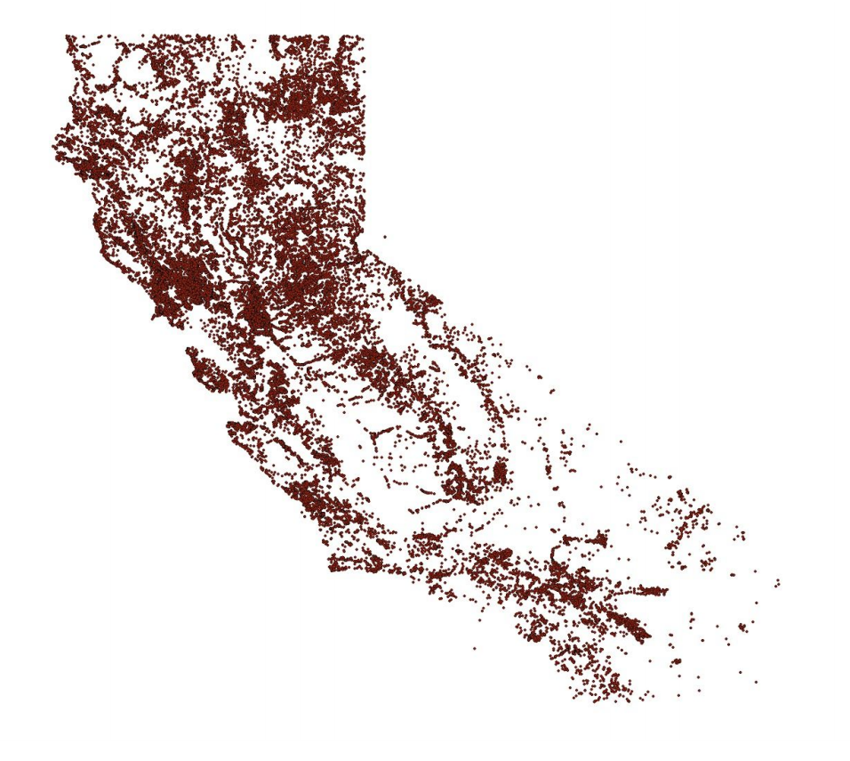

# EWRIMS Scraped Database

This module scrapes the entire EWRIMS database and organizes it in a single digital database. If the database has already been assembled or a previous version has been downloaded, this module enables appending new applications and reports to existing the datasets. This module was developed in consultation with the Center for Environmental Economics and Sustainability Policy at the W.P. Carey School of Business under the direction of Dr. William Michael Hanemann. 

## Overview of the EWRIMS

**Applications:** each application record is an application to the water rights for a specific body of water. Applications may detail beneficial water use among other pertinant details. Applications may be submitted multiple times over time as required by local authorities, private contracts, or others. *The state of California does not penalize a failure to apply for water rights so this database is not a complete representation of water use in the state.*

**Reports:** these may be submitted in association with specific applications. Reports cover a wide vireity of topics and may describe anything from the amount of water used over time to conservations efforts to changes to the project to methods of measurement.

There is an accompanying GIS component to this database that shows the bodies of water for california and allow for cross-referencing using latitude and longitude data in the application data. 

### Database Directory 

The database directory contains `.csv` versions of each type of dataset as well as `.pickle` files for the larger datasets (for faster loading). The **dictionary** folder contains .csv files listing every field and example values for each of the datasets. 

*For more additional documentation regarding the organization of the data please refer to the* **Database Documentation - GIS Resources.pdf** *and* **Database Documentation - Water Rights.pdf** *documents.*

## Notebook Walkthrough

The `ewrims_scrape.ipynb` notebook provides a walkthrough of the methods in `ewmirs_scrape.py`. It will implement the methods to scrape the data, applications and reports, compare records to older data, and collect and append the details of any new data into the local datasets.

## Large Files

This repository uses [Git Large File Storage or LFS](https://git-lfs.github.com/) to store large files. 

## Dependencies 

* pandas
* selenium
* BeautifulSoup

Scripts will self-install non-native dependencies when executed using `pip`.
